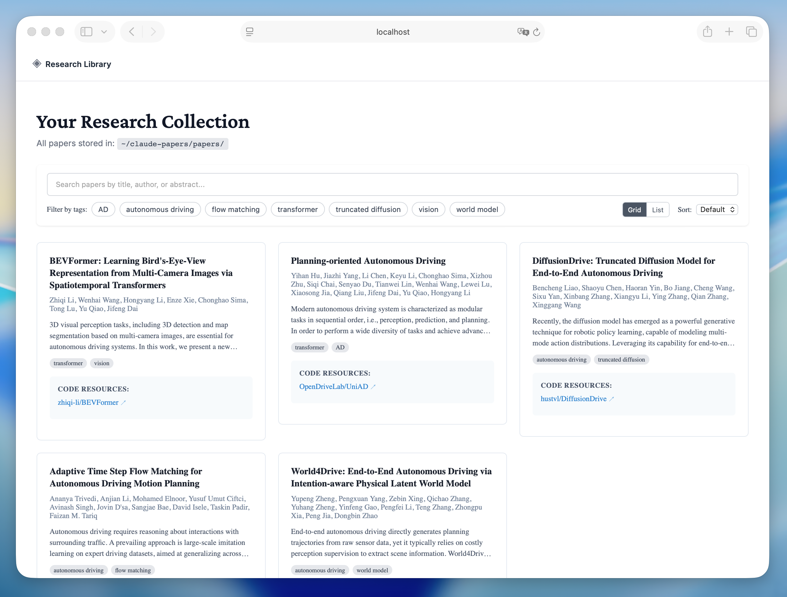
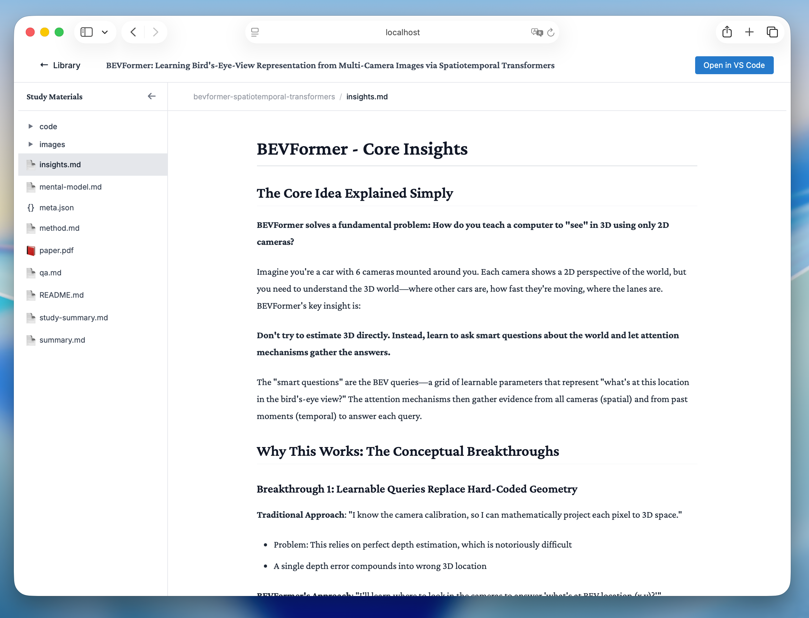

<div align="center">

# Codex Paper

**Transform research papers into comprehensive learning environments**

[English](README.md) | [中文](README.zh-CN.md)

[](./LICENSE)
[](https://nodejs.org)
[](https://openai.com)

A research-paper study project that now includes a **Codex plugin skeleton** alongside the original implementation, plus a parser benchmark and an evidence-first paper preparation pipeline. The `$paper-study` workflow is designed for Codex to read the paper and evidence files, then author a complete study package instead of templating parsed JSON into final user-facing materials.

<table>
  <tr>
    <td align="center">
      
      <br/>
      <sub>Library View - Browse and search your paper collection</sub>
    </td>
    <td align="center">
      
      <br/>
      <sub>Reading View - Study papers with rich formatting and math support</sub>
    </td>
  </tr>
</table>

</div>

## Features

- **Automatic PDF parsing** - Extract title, authors, abstract, sections, and code links with a layered parser
- **Smart content truncation** - Handles large papers (50k char limit) intelligently
- **Code repository detection** - Automatically finds GitHub, arXiv, CodeOcean links
- **Evidence-first paper prep** - Generates internal evidence files such as `paper-data.json`, `facts.json`, and `analysis.json`
- **Parser benchmark suite** - Regressions are checked against a fixed 5-paper gold set
- **Codex-authored study package** - Produces `README.md`, `summary.md`, `insights.md`, `method.md`, `mental-model.md`, `reflection.md`, and `qa.md` from the paper and evidence
- **Code demonstrations** - Generates at least one independently runnable code example tied to the paper's core idea
- **Interactive web viewer** - Nuxt.js interface that shows user-facing materials by default, hides internal JSON, and renders each paper's `index.html` in an iframe
- **Intelligent assessment** - Difficulty levels and paper type detection for adaptive content generation

---

## Codex Plugin Skeleton

This repository now includes a Codex-ready skeleton that preserves the current skills, hooks, parser scripts, and web viewer:

- Codex plugin root: `plugins/codex-paper/`
- Codex manifest: `plugins/codex-paper/.codex-plugin/plugin.json`
- Repo-local marketplace entry: `.agents/plugins/marketplace.json`
- Original source retained for reference: `plugin/`

The new Codex skeleton is additive: it keeps the original implementation intact while exposing a standard Codex plugin layout that we can keep iterating on.

Public names are intentionally explicit:

- Plugin name: `codex-paper`
- Deep study skill: `$paper-study`
- Quick summary skill: `$paper-summary`
- Web viewer skill: `$paper-webui`

---

## Quick Start

### Installation

Install by registering this repository as a Codex marketplace:

```bash
git clone https://github.com/byxshr/codex-paper.git ~/codex-paper
```

Add the marketplace and enable the plugin in `~/.codex/config.toml`:

```toml
[marketplaces.codex-paper]
source_type = "local"
source = "/Users/YOUR_USER/codex-paper"

[plugins."codex-paper@codex-paper"]
enabled = true
```

Replace `/Users/YOUR_USER/codex-paper` with the absolute path to your clone, then restart Codex. Open `/plugins`, search for `codex-paper`, and install or enable it from the plugin browser if prompted.

After restart, use:

```text
Use $paper-study to read ~/Downloads/attention-is-all-you-need.pdf and generate a complete study package.
```

For a quick summary:

```text
Use $paper-summary to summarize https://arxiv.org/abs/1706.03762
```

**That's it!** The plugin will automatically:
- Install all dependencies (Node.js packages plus `PyMuPDF` for PDF processing)
- Create the papers directory at `~/codex-papers/`
- Initialize the search index
- Install web viewer dependencies

### System Requirements

- **Node.js**: 18.0.0 or higher
- **npm**: Comes with Node.js
- **Codex**: Latest version with plugin support
- **poppler-utils**: For PDF image extraction (install via system package manager)
  - **macOS**: `brew install poppler`
  - **Ubuntu/Debian**: `sudo apt-get install poppler-utils`
  - **Arch Linux**: `sudo pacman -S poppler`

---

## Usage

### Study a Research Paper

Simply talk to Codex to study a paper:

```
Use $paper-study to read ~/Downloads/attention-is-all-you-need.pdf and generate a complete study package.
```

You can also use URLs:

```
# Direct PDF URL
Use $paper-study to read https://arxiv.org/pdf/1706.03762.pdf

# arXiv abstract URL (automatically converted to PDF)
Use $paper-study to read https://arxiv.org/abs/1706.03762
```

For a quick summary only:

```
Use $paper-summary to summarize https://arxiv.org/abs/1706.03762
```

Codex will automatically trigger the study workflow and:
1. Parse the PDF and prepare metadata, text, facts, and evidence files
2. Read `paper-data.json`, `facts.json`, `analysis.json`, and paper text chunks as needed
3. Author complete study materials from evidence instead of directly rendering machine JSON
4. Generate a self-contained interactive `index.html`
5. Create at least one independently runnable code demonstration
6. Copy the original `paper.pdf` and extract key figures and images where possible
7. Update the global search index
8. Launch the web viewer automatically

### Launch Web Viewer

```text
Use $paper-webui to start the Codex Paper web viewer.
```

Opens the interactive web interface at **http://localhost:5815** where you can:
- Browse all studied papers
- View generated Markdown, HTML, PDF, image, and code materials
- Explore each paper's `index.html` interactively in an iframe
- Access code demonstrations
- Search through your paper library

---

## Paper Storage Structure

Papers are organized in `~/codex-papers/papers/{paper-slug}/`:

```
~/codex-papers/
├── papers/
│   └── {paper-slug}/
│       ├── README.md                     # Quick navigation and overview
│       ├── summary.md                    # Detailed summary
│       ├── insights.md                   # Key insights (most important!)
│       ├── method.md                     # Method structure, flow, pseudocode, reproducibility risks
│       ├── mental-model.md              # Prior knowledge, research map, and paper categorization
│       ├── reflection.md                # Extensions, fragile assumptions, and future questions
│       ├── qa.md                         # Layered learning questions and answers
│       ├── index.html                    # Interactive HTML explorer
│       ├── paper.pdf                     # Copy of the original PDF
│       ├── images/                       # Extracted figures and tables
│       │   ├── fig1.png
│       │   └── fig2.png
│       └── code/                         # Code demonstrations
│           └── core-concept-demo.py      # At least one runnable core-concept example
│
│       # The following JSON files are internal evidence files and hidden in the Web UI by default
│       ├── paper-data.json               # Canonical parsed paper facts
│       ├── facts.json                    # Evidence-first claims, results, limitations
│       ├── analysis.json                 # Structured analysis draft
│       └── meta.json                     # Paper metadata (title, authors, etc.)
│
└── index.json                           # Global search index
```

---

## Architecture

### Plugin Structure

```
codex-paper/
├── .codex-plugin/
│   └── marketplace.json              # Marketplace catalog entry
├── plugin/                           # Legacy copy kept for reference
├── plugins/
│   └── codex-paper/
│       ├── .codex-plugin/
│   │   └── plugin.json              # Plugin manifest
│       ├── skills/
│       │   ├── study/
│       │   │   ├── SKILL.md             # Study workflow definition
│       │   │   └── scripts/
│       │   │       ├── parse-pdf.js     # Stable JSON parser
│       │   │       ├── prepare-paper.js # Canonical paper preparation pipeline
│       │   │       └── extract-images.py
│       │   └── summary/
│       │       └── SKILL.md             # Evidence-constrained quick summary
│       ├── hooks/
│       │   ├── hooks.json               # Session lifecycle hooks
│       │   └── check-install.sh
│       ├── src/
│       │   └── web/                     # Nuxt.js web viewer
│       └── package.json
├── benchmarks/
│   ├── manifest.json                    # Fixed parser benchmark set
│   ├── gold/                            # Gold expectations for the 5 papers
│   ├── run-benchmark.mjs                # Benchmark executor
│   └── benchmark-report.mjs             # Human-readable report formatter
└── README.md
```

### Key Components

1. **Study Skill** - Codex paper-reading and writing agent that generates the full study package
2. **PDF Parser** - Uses a layered `PyMuPDF`-first parser with `pdf-parse` fallback and stable JSON output
3. **Image Extractor** - Python script for PDF figure extraction
4. **Preparation Pipeline** - Produces internal evidence files `paper-data.json`, `facts.json`, `analysis.json`, `meta.json`, and updates `~/codex-papers/index.json`
5. **Web Viewer** - Nuxt.js application with Nitro APIs that displays user materials by default and hides machine JSON
6. **Hooks System** - Automatic dependency installation and setup

---

## Development

### One Entry Script

Use a single root script for local setup and testing:

```bash
bash scripts/codex-paper.sh install
bash scripts/codex-paper.sh build
bash scripts/codex-paper.sh start
bash scripts/codex-paper.sh stop
bash scripts/codex-paper.sh status
bash scripts/codex-paper.sh smoke-test
bash scripts/codex-paper.sh benchmark
bash scripts/codex-paper.sh benchmark-report
```

This keeps the local workflow in one place while `scripts/common.sh` stays internal.

### Running Tests

```bash
# Test PDF parsing
node plugins/codex-paper/skills/study/scripts/parse-pdf.js /path/to/paper.pdf

# Prepare a paper into paper-data.json and facts.json
node plugins/codex-paper/skills/study/scripts/prepare-paper.js /path/to/paper.pdf

# Validate a generated study package
node plugins/codex-paper/skills/study/scripts/validate-study-package.js paper-slug --lang zh --run-code

# Run the parser regression benchmark
bash scripts/codex-paper.sh benchmark

# Test web viewer
bash scripts/codex-paper.sh start
```

### Building for Production

```bash
# Build web viewer
bash scripts/codex-paper.sh build

# The built viewer will be in .output/
```

---

## Configuration

### Environment Variables

No configuration required! The plugin uses sensible defaults:

- **Papers directory**: `~/codex-papers/`
- **Benchmark directory**: `~/codex-papers/paper-examples`
- **Web viewer port**: `5815`
- **Content limit**: `50,000` characters (with intelligent truncation)

### Advanced Customization

You can modify behavior by editing:

- `plugins/codex-paper/skills/study/SKILL.md`
- `plugins/codex-paper/skills/summary/SKILL.md`
- `benchmarks/gold/*.json`

---

## Contributing

Contributions are welcome! Please:

1. Fork the repository
2. Create a feature branch (`git checkout -b feature/amazing-feature`)
3. Make your changes
4. Add tests if applicable
5. Commit your changes (`git commit -m 'add amazing feature'`)
6. Push to the branch (`git push origin feature/amazing-feature`)
7. Open a Pull Request

---

## License

This project is licensed under the **MIT License** - see the [LICENSE](LICENSE) file for details.

---

## Acknowledgments

- Built for Codex
- PDF parsing powered by [PyMuPDF](https://pymupdf.readthedocs.io/) with [pdf-parse](https://www.npmjs.com/package/pdf-parse) fallback
- Web viewer built with [Nuxt.js](https://nuxt.com)
- Math rendering by [KaTeX](https://katex.org)
