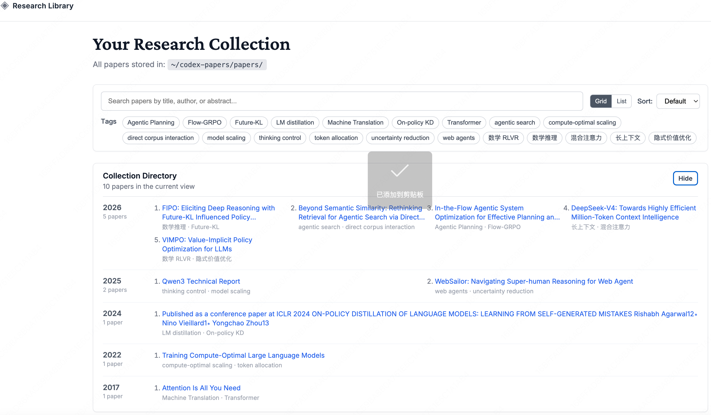
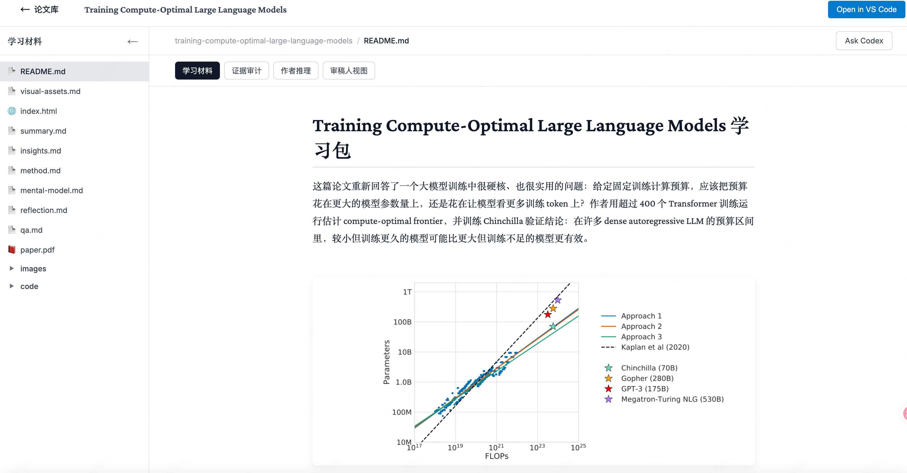

<div align="center">

# Codex Paper

**Transform research papers into comprehensive learning environments**

[English](README.md) | [中文](README.zh-CN.md)

[](./LICENSE)
[](https://nodejs.org)
[](https://openai.com)

Codex Paper is a Codex plugin that turns research papers into local study workspaces. It first builds a paper-only evidence record and a structured reasoning analysis, then has Codex write grounded notes, explanations, code demos, visuals, an interactive page, and follow-up Q&A context from that evidence instead of templating raw parser output into study materials.

<table>
  <tr>
    <td align="center">
      
      <br/>
      <sub>Library - Search, filter, and open saved paper study packages</sub>
    </td>
    <td align="center">
      
      <br/>
      <sub>Paper View - Read grounded notes, reasoning analysis, evidence audit, and follow-up context</sub>
    </td>
  </tr>
</table>

</div>

## Features

- **Automatic PDF parsing** - Extract title, authors, abstract, sections, and code links with a layered parser
- **Bounded PDF ingestion** - HTTPS-only URL fetching with redirect SSRF checks, DNS pinning, 128 MiB streaming limits, isolated parsing, page/resource budgets, and private bounded quarantine
- **Long-paper handling** - Parses large papers with quality flags and graceful fallbacks when extraction is incomplete
- **Code repository detection** - Automatically finds GitHub, arXiv, CodeOcean links
- **Evidence-first paper prep** - Generates internal evidence files such as `paper-data.json`, `facts.json`, and `analysis.json`
- **Typed quantitative results** - Package 2.1 binds metric values to task/dataset/location context and direct paper evidence while retaining a `keyResults` compatibility projection
- **Evidence ledger** - Writes `evidence-ledger.json` with stable evidence IDs, page text, section trees, evidence units, natural locations, and parser quality degradations
- **Research reasoning analysis** - Adds `reasoning-analysis.json` for central claims, research question, author reasoning path, validations, weakest assumption, minimal reproduction, strongest counterexample, follow-up idea, and uncertainty zones
- **Semantic validation** - Checks schema, evidence references, source types, numeric grounding, reasoning graph cycles, critical-analysis coverage, and template residue
- **Context modes** - Defaults to offline `paper-only`; `canonical` and `literature` keep external evidence in `.codex-paper/external-evidence.json` instead of mixing it into the paper ledger
- **Deterministic parser gates** - Two redistributable synthetic PDFs are mandatory on every PR; the separate 5-paper external corpus remains optional in CI
- **Reasoning and package benchmarks** - Adds deterministic fixtures for reasoning quality and visible study-package regressions
- **Codex-authored study package** - Produces `README.md`, `summary.md`, `insights.md`, `method.md`, `mental-model.md`, `reflection.md`, and `qa.md` from the paper and evidence
- **Curated visual learning path** - Adds `visual-assets.md` and embeds only high-value, source-labeled figures, tables, and deterministic diagrams where they support the prose
- **Code demonstrations** - Generates at least one independently runnable code example tied to the paper's core idea
- **Paired local web viewer** - Loopback-only Nuxt.js interface with session/CSRF protection, safe file boundaries, recoverable trash, and hidden internal JSON
- **Ask Codex follow-ups** - Paper pages can send grounded follow-up questions to Codex and save answers in `chat-notes.md`
- **Intelligent assessment** - Difficulty levels and paper type detection for adaptive content generation

---

## Codex Plugin Layout

This repository has one authoritative Codex plugin implementation in `plugins/codex-paper/`:

- Codex plugin root: `plugins/codex-paper/`
- Codex manifest: `plugins/codex-paper/.codex-plugin/plugin.json`
- Repo-local marketplace entry: `.agents/plugins/marketplace.json`
- Root install/build/test automation entrypoint: `scripts/codex-paper.sh`

Installation must use the repository marketplace entry that points at `plugins/codex-paper/`. The former top-level legacy tree was removed and remains available only in Git history. If a local script hard-codes the old singular tree path, reinstall from the repository marketplace and update the script to use `plugins/codex-paper/`.

Public names are intentionally explicit:

- Plugin name: `codex-paper`
- Deep study skill: `$paper-study`
- Quick summary skill: `$paper-summary`
- Web viewer skill: `$paper-webui`
- Follow-up Q&A skill: `$paper-chat`

---

## Quick Start

### Installation

Install by registering this repository as a Codex marketplace:

```bash
git clone https://github.com/byxshr/codex-paper.git ~/codex-paper
```

Add the marketplace and enable the plugin in `~/.codex/config.toml`:

```toml
[marketplaces.codex-paper]
source_type = "local"
source = "/Users/YOUR_USER/codex-paper"

[plugins."codex-paper@codex-paper"]
enabled = true
```

Replace `/Users/YOUR_USER/codex-paper` with the absolute path to your clone, then restart Codex. Open `/plugins`, search for `codex-paper`, and install or enable it from the plugin browser if prompted.

If you already installed an older Codex Paper plugin, update or reinstall it from `/plugins` after pulling this repository. Prefer the local marketplace entry that points at this checkout. If both an old `codex-paper@codex-paper` entry and a local `codex-paper@codex-paper-local` entry are enabled, disable the stale one so Codex loads the intended version.

After restart, use:

```text
Use $paper-study to read ~/Downloads/attention-is-all-you-need.pdf and generate a complete study package.
```

For a quick summary:

```text
Use $paper-summary to summarize https://arxiv.org/abs/1706.03762
```

The repository setup command will:
- Verify Node.js/npm and create a private, hash-locked Python runtime
- Install the two Node.js dependency trees without dependency lifecycle scripts
- Create the papers directory at `~/codex-papers/`
- Initialize the search index
- Install web viewer dependencies

### System Requirements

- **Node.js**: exactly 22.23.1
- **npm**: exactly 10.9.8
- **CPython**: exactly 3.11.15, used only to create the managed venv
- **Codex**: Latest version with plugin support
- **Native runtime inspection tools**:
  - **macOS**: Xcode Command Line Tools (`xcode-select --install`) for `otool`, `install_name_tool`, and `codesign`
  - **Linux**: `binutils` for `readelf`; the bootstrap must already use relocatable or system native-library references
- **poppler-utils**: For PDF image extraction (install via system package manager)
  - **macOS**: `brew install poppler`
  - **Ubuntu/Debian**: `sudo apt-get install poppler-utils`
  - **Arch Linux**: `sudo pacman -S poppler`

---

## Usage

### Study a Research Paper

Simply talk to Codex to study a paper:

```
Use $paper-study to read ~/Downloads/attention-is-all-you-need.pdf and generate a complete study package.
```

You can also use URLs:

```
# Direct PDF URL
Use $paper-study to read https://arxiv.org/pdf/1706.03762.pdf

# arXiv abstract URL (automatically converted to PDF)
Use $paper-study to read https://arxiv.org/abs/1706.03762
```

Remote paper inputs must use HTTPS. Every redirect is revalidated against private, loopback, link-local, metadata, reserved, ULA, and IPv4-mapped address ranges. A valid `%PDF-` signature and successful bounded parse are required; `.pdf` suffix and `Content-Type` are advisory only.

For a quick summary only:

```
Use $paper-summary to summarize https://arxiv.org/abs/1706.03762
```

For follow-up questions about a saved study package:

```
Use $paper-chat to answer a question about ~/codex-papers/papers/attention-is-all-you-need:
What is the key difference between self-attention and recurrent sequence modeling?
```

Codex will automatically trigger the study workflow and:
1. Parse the PDF and prepare metadata, text, facts, analysis, and the evidence ledger in a private generation workspace
2. Infer the paper profile, scaffold `reasoning-analysis.json`, and read the relevant profile contract
3. Fill research reasoning from paper evidence through the CAS-protected workspace writer, then run the reasoning gate before visible authoring
4. Author complete study materials through the same shared writer instead of directly editing package files
5. Generate a self-contained interactive `index.html`
6. Create at least one independently runnable code demonstration
7. Copy the original `paper.pdf`, curate useful visual assets, and avoid dumping low-value extracted fragments into the reading flow
8. Create a hidden answering pack for future grounded follow-up questions
9. Run the complete standard Validation Report gate
10. Seal a Generation Manifest, atomically commit the current generation, and rebuild the index cache

Preparation intentionally does not publish new workspaces. Publication is a separate exact-workspace command after the complete standard gate; it seals immutable package bytes and makes the generation visible only when `current.json` is committed. There is no implicit "latest workspace" selection.

### Launch Web Viewer

```text
Use $paper-webui to start the Codex Paper web viewer.
```

The startup terminal prints a fresh pairing token. Open **http://127.0.0.1:5815**, paste that token into the pairing gate, and keep the terminal token private. It is exchanged in a request body for an HttpOnly session and never belongs in a URL.

In the Viewer you can:
- Browse all studied papers
- View generated Markdown, HTML, PDF, image, and code materials
- Inspect HTML source and explicitly open a scriptless **static safe preview**; generated JavaScript is never executed in the Viewer
- Read structured Notebook cells while HTML, SVG, and JavaScript rich outputs are downgraded to visible blocked text
- Inspect SVG source or download the file safely instead of rendering it inline
- Access code demonstrations
- Ask Codex follow-up questions from a paper page and save answers to `chat-notes.md`
- Search through your paper library
- Move papers to recoverable trash and restore them from the Trash panel

The service binds only to IPv4 loopback. Every restart invalidates existing Viewer sessions and creates a new pairing token. The SPA runs with a self-only script CSP; Markdown and model answers are rendered and sanitized on the server. See [`docs/local-viewer-security.md`](docs/local-viewer-security.md) for the API/filesystem boundary and [`docs/web-active-content-security.md`](docs/web-active-content-security.md) for the rendering boundary.

Ask Codex lazily starts one long-running `codex mcp-server` worker the first time a web question is asked. The web viewer keeps a separate Codex thread and request queue per paper, so follow-up questions for the same paper reuse conversation context without starting a new `codex exec` process each time. A failed or empty reply invalidates only that paper's cached thread, allowing its next request to start fresh without resetting unrelated papers or the shared worker. Once an answer exists it is always returned, even if chat-note persistence, lock release, or rich Markdown rendering fails; rendering failure falls back to escaped plain text and the response carries an explicit saved/unsaved result and warning. A lightweight in-process paper lease makes Web deletion fail with a retryable conflict while an Ask is active, without acquiring or holding a cross-process lock for the external call. Answers still run with a read-only sandbox and use `.codex-paper/answering-pack.md` when available, falling back to visible Markdown materials and local evidence files for older packages.

---

## Paper Storage Structure

New packages use Paper Library Layout 1.0. Route slugs are index aliases only; every CLI and Viewer request resolves the authoritative `current.json` instead of constructing `papers/{slug}` paths:

```
~/codex-papers/
├── .codex-paper/workspaces-v1/{workspaceId}/ # Private authoring/validation or publication journal
│   ├── workspace.json                        # Bounded state and publish intent
│   ├── publication.json                      # Bounded idempotent recovery journal after sealing
│   └── package/                              # Present until publication atomically moves it
├── .codex-paper/locks-v1/                    # Cross-process lock ownership records
├── .codex-paper/store-v1/papers/{paperKey}/
│   ├── paper.json                       # Paper identity aliases and reconciliation audit
│   ├── current.json                     # Authoritative current source/generation pointer
│   ├── overlay/                         # Mutable state outside every generation
│   │   ├── state.json                   # Tags, progress, and annotations
│   │   ├── chat-notes.md                # Follow-up Q&A notes
│   │   └── files/                       # User overlay files (shown under user/)
│   └── sources/{sourceRevision}/generations/{generation}/package/
│       ├── README.md, summary.md, insights.md, method.md, ...
│       ├── paper.pdf, images/, code/, index.html
│       ├── paper-data.json, evidence-ledger.json, facts.json, analysis.json
│       ├── reasoning-analysis.json, meta.json
│       └── .codex-paper/                 # Identity, validation, answering, and sealed generation manifest
├── papers/{legacy-slug}/                 # Existing flat 2.0/2.1 packages; read-only until migration
├── index.json                            # Compatibility/search projection, not identity authority
└── .trash/{trashId}/{tombstone,payload}  # Recoverable lifecycle envelope
```

### Validation and Migration

Run the full deterministic suite:

```bash
bash scripts/codex-paper.sh install
bash scripts/codex-paper.sh runtime-status
bash scripts/codex-paper.sh dependency-audit
bash scripts/codex-paper.sh secret-scan
bash scripts/codex-paper.sh supply-chain-test
bash scripts/codex-paper.sh test
bash scripts/codex-paper.sh identity-test
bash scripts/codex-paper.sh layout-test
bash scripts/codex-paper.sh storage-test
bash scripts/codex-paper.sh publication-test
bash scripts/codex-paper.sh provenance-test
bash scripts/codex-paper.sh benchmark-mandatory
bash scripts/codex-paper.sh benchmark-all
bash scripts/codex-paper.sh smoke-test
bash scripts/codex-paper.sh build
```

Workspace operations are explicit and CAS-protected:

```bash
bash scripts/codex-paper.sh workspace-list --json
bash scripts/codex-paper.sh workspace-inspect <workspace-id-or-path> --json
bash scripts/codex-paper.sh workspace-write <workspace> README.md --stdin --expect-absent --actor codex
bash scripts/codex-paper.sh provenance-resolve <workspace> --adopt-current <event-id>
bash scripts/codex-paper.sh workspace-tags <workspace> --tag <domain> --tag <method>
bash scripts/codex-paper.sh workspace-abandon <workspace> --json
bash scripts/codex-paper.sh publish-workspace <validated-workspace> --json
bash scripts/codex-paper.sh publication-recover --json
bash scripts/codex-paper.sh reindex --json
bash scripts/codex-paper.sh provenance-inspect <paper-or-workspace> --json
bash scripts/codex-paper.sh provenance-verify <paper-or-workspace> --json
```

Only a complete, intrinsically publishable Validation Report with the standard `allow_publish` gate can be published. New publications use Generation Manifest 2.0 as the sole authoritative provenance record, including source, content runtime, software, authoring events, artifact DAG, validation, and pre-seal execution bindings. Manifest 1.0 stays read-only compatible. `current.json` is the visibility commit point; `index.json` is a rebuildable projection.

Validate one completed study package:

```bash
node plugins/codex-paper/skills/study/scripts/validate-reasoning.js {paper-route-slug}
node plugins/codex-paper/skills/study/scripts/validate-study-package.js {paper-route-slug}
```

The reasoning command emits a draft-phase `allow_authoring` gate. The final standard package gate permits `pass_with_warnings`; add `--strict` only when warnings should block. Both commands update the single `.codex-paper/validation-report.json` report. Study-package validation is static and never executes generated code. Optional execution uses a separately prepared Docker sandbox and requires a fresh, code-hash-bound approval for every run:

```bash
# Explicit setup: build the digest-pinned image and run conformance tests
bash scripts/codex-paper.sh sandbox-setup

# Inspect files, hashes, commands, permissions, and limits
bash scripts/codex-paper.sh sandbox-plan {paper-route-slug}

# Only after the user approves that exact plan
bash scripts/codex-paper.sh sandbox-run {paper-route-slug} --approval-token <one-time-token>
```

The token binds the exact plan and prevents replay; it does not authenticate a human. Agent workflows must stop after showing the plan and wait for a new explicit user approval before running it.

Without a conformant Docker engine the runner reports `unavailable` or `nonconformant` and never falls back to host Python, Node, or a shell. The container has no network, sees only `code/` read-only, inherits no host credentials, and can write only to a bounded temporary directory.

Inventory the library and diagnose compatibility or layout drift without writing to it:

```bash
bash scripts/codex-paper.sh library-inventory --json
bash scripts/codex-paper.sh library-doctor --json
```

`library-doctor` performs full backup payload verification; the lighter `library-inventory` and
migration planner report `payloadsVerified: false`. Index drift is checked per paper authority, so one
broken sibling cannot suppress drift findings for otherwise readable papers.
The current output is Doctor Report 1.1, which adds migration transaction/archive visibility; Doctor Report 1.0 remains read-only compatible.

In-place migration remains retired. Explicit migration requires a content-addressed paper backup and a reviewable new-generation workspace:

```bash
bash scripts/codex-paper.sh backup-create {paper-route-slug} --json
bash scripts/codex-paper.sh backup-verify {backup-id} --json
bash scripts/codex-paper.sh migration-dry-run {paper-route-slug} --backup-id {backup-id} --json
bash scripts/codex-paper.sh migration-start {paper-route-slug} --backup-id {backup-id} --json
```

Backups live under `.codex-paper/backups-v1/`, are excluded from the Viewer and index, and preserve directory modes and empty directories as well as file bytes. They can be restored only when the target is absent or byte-identical. An identical-target no-op preserves live curated index metadata; a different existing target is always a conflict. Corrupt snapshots are retained in quarantine and recreated, while unrelated malformed journals cannot block healthy recovery. Private failed staging is permission-normalized before cleanup, including snapshots of sealed generations. Use `backup-recover` to resume a journaled restore after interruption.

The legacy `migrate` command now accepts only `--dry-run` as a compatibility alias:

```bash
bash scripts/codex-paper.sh migrate {paper-route-slug} --dry-run --backup-id {backup-id} --json
```

`migration-start` leaves the source, current record, and index unchanged. Complete authoring and standard validation in the returned exact workspace, then run `migration-commit`. The current parser rebuilds the evidence layer; approved authoring files are preserved through the shared writer, and a validated Evidence Alias Map resolves old references without rewriting sealed sources. Only one migration may be active per paper. Migrated `code/**` files are limited to 1 MiB each; other approved authoring files are limited to 16 MiB.

```bash
bash scripts/codex-paper.sh migration-inspect {migration-id-or-workspace} --json
bash scripts/codex-paper.sh migration-commit {migration-id-or-workspace} --json
bash scripts/codex-paper.sh migration-recover --json
bash scripts/codex-paper.sh migration-rollback {migration-id} --expected-current-manifest-hash {sha256} --json
bash scripts/codex-paper.sh migration-rollforward {migration-id} --json
bash scripts/codex-paper.sh reindex --dry-run --paper {paper-route-slug} --json
```

Rollback uses current-manifest compare-and-swap. A legacy rollback restores the original flat authority exactly and retains the managed target privately for explicit roll-forward. External paths, trash entries, and active workspaces are not migration sources.

See [Paper Library Layout 1.0](docs/paper-library-layout-1.0.md), the [compatibility/backup contract](docs/package-compatibility-backup-recovery-1.0.md), [explicit migration contract](docs/explicit-generation-migration-1.0.md), [evidence ledger](docs/evidence-ledger.md), [reasoning analysis](docs/reasoning-analysis.md), [package contract](docs/package-v2.md), and [migration guide](docs/migration-v1-to-v2.md) for the detailed contracts.

---

## Architecture

### Plugin Structure

```
codex-paper/
├── .agents/
│   └── plugins/
│       └── marketplace.json          # Authoritative marketplace catalog
├── plugins/
│   └── codex-paper/
│       ├── .codex-plugin/
│       │   └── plugin.json              # Plugin manifest
│       ├── skills/
│       │   ├── study/
│       │   │   ├── SKILL.md             # Study workflow definition
│       │   │   └── scripts/
│       │   │       ├── parse-pdf.js     # Stable JSON parser
│       │   │       ├── prepare-paper.js # Canonical paper preparation pipeline
│       │   │       └── extract-images.py
│       │   ├── summary/
│       │   │   └── SKILL.md             # Evidence-constrained quick summary
│       │   ├── chat/
│       │   │   └── SKILL.md             # Grounded follow-up Q&A
│       │   └── webui/
│       │       └── SKILL.md             # Local viewer launcher
│       ├── hooks/
│       │   ├── hooks.json               # Session lifecycle hooks
│       │   └── check-install.sh
│       ├── src/
│       │   └── web/                     # Nuxt.js web viewer
│       └── package.json
├── scripts/
│   ├── codex-paper.sh                # Root install/build/test entrypoint
│   └── check-repository.mjs          # Repository contract gate
├── benchmarks/
│   ├── fixtures/pdf/                    # Redistributable deterministic PDF fixtures
│   ├── mandatory/                       # Non-skippable assertions and expected findings
│   ├── manifest.json                    # Optional external parser corpus
│   ├── gold/                            # Gold expectations for the external papers
│   ├── reasoning/                       # Reasoning validator fixtures
│   ├── packages/                        # Visible package quality fixtures
│   ├── run-mandatory-benchmark.mjs      # Bounded PDF-to-validator gate
│   ├── run-benchmark.mjs                # Optional external benchmark executor
│   ├── run-reasoning-benchmark.mjs      # Reasoning benchmark entrypoint
│   ├── run-package-benchmark.mjs        # Package benchmark entrypoint
│   └── benchmark-report.mjs             # Human-readable report formatter
└── README.md
```

### Key Components

1. **Study Skill** - Codex paper-reading and writing agent that generates the full study package
2. **PDF Parser** - Uses a layered `PyMuPDF`-first parser with `pdf-parse` fallback and stable JSON output
3. **Image Extractor** - Python script for PDF figure extraction
4. **Preparation Pipeline** - Produces internal evidence files `paper-data.json`, `facts.json`, `analysis.json`, `meta.json`, and `evidence-ledger.json`, then updates `~/codex-papers/index.json`
5. **Research Reasoning Validation** - Uses `reasoning-analysis.json`, paper profiles, and `validate-reasoning.js` to check evidence refs, source types, numeric grounding, reasoning DAGs, and critical analysis
6. **Web Viewer** - Nuxt.js application with Nitro APIs that displays user materials by default, hides machine JSON, and shows evidence audit and reasoning views
7. **Ask Codex API** - Reuses a long-running Codex MCP worker for grounded follow-up questions, then appends answers to `chat-notes.md`
8. **Runtime and Supply-chain Policy** - Explicit runtime setup, dependency audit, secret scan, and immutable supply-chain review

---

## Development

### One Entry Script

Use a single root script for local setup and testing:

```bash
bash scripts/codex-paper.sh install
bash scripts/codex-paper.sh build
bash scripts/codex-paper.sh start
bash scripts/codex-paper.sh stop
bash scripts/codex-paper.sh status
bash scripts/codex-paper.sh runtime-setup
bash scripts/codex-paper.sh runtime-status
bash scripts/codex-paper.sh dependency-audit
bash scripts/codex-paper.sh secret-scan
bash scripts/codex-paper.sh supply-chain-test
bash scripts/codex-paper.sh repo-test
bash scripts/codex-paper.sh smoke-test
bash scripts/codex-paper.sh benchmark-mandatory
bash scripts/codex-paper.sh benchmark
bash scripts/codex-paper.sh benchmark-all
bash scripts/codex-paper.sh benchmark-report
```

This keeps the local workflow in one place while `scripts/common.sh` stays internal.

### Running Tests

```bash
# Run static Repository Guard mutation tests without a managed Python runtime
bash scripts/codex-paper.sh repo-test

# Test PDF parsing
node plugins/codex-paper/skills/study/scripts/parse-pdf.js /path/to/paper.pdf

# Test HTTPS downloader, parser budgets, and private quarantine
bash scripts/codex-paper.sh pdf-security-test

# Prepare a paper into paper-data.json, facts.json, and evidence-ledger.json
bash scripts/codex-paper.sh prepare /path/to/paper.pdf --workflow study --language en \
  --authoring-provider unavailable --authoring-model unavailable

# Test identity, fingerprint, reuse, and flat-layout collision protection
bash scripts/codex-paper.sh identity-test

# Test unified provenance and Manifest 1.0/2.0 compatibility
bash scripts/codex-paper.sh provenance-test

# Validate research reasoning
node plugins/codex-paper/skills/study/scripts/validate-reasoning.js paper-slug

# Validate a generated study package
node plugins/codex-paper/skills/study/scripts/validate-study-package.js paper-slug --lang zh

# Run the Validation Report 1.0 contract tests
bash scripts/codex-paper.sh validation-test

# Check optional generated-code sandbox capability (does not execute code)
bash scripts/codex-paper.sh sandbox-status

# Run the non-skippable synthetic PDF-to-validator regression
bash scripts/codex-paper.sh benchmark-mandatory

# Run mandatory PDF, optional external parser, reasoning, and package benchmarks
bash scripts/codex-paper.sh benchmark-all

# Test web viewer
bash scripts/codex-paper.sh start
```

### Building for Production

```bash
# Build web viewer
bash scripts/codex-paper.sh build

# The built viewer will be in plugins/codex-paper/src/web/.output/
```

---

## Configuration

### Environment Variables

No configuration required! The plugin uses sensible defaults:

- **Papers directory**: `~/codex-papers/`
- **Benchmark directory**: `~/codex-papers/paper-examples`
- **Web viewer port**: `5815`
- **Long-paper behavior**: extraction quality flags and fallbacks are recorded in the generated package

### Advanced Customization

You can modify behavior by editing:

- `plugins/codex-paper/skills/study/SKILL.md`
- `plugins/codex-paper/skills/summary/SKILL.md`
- `benchmarks/gold/*.json`

---

## Contributing

Contributions are welcome! Please:

1. Fork the repository
2. Create a feature branch (`git checkout -b feature/amazing-feature`)
3. Make your changes
4. Add tests if applicable
5. Commit your changes (`git commit -m 'add amazing feature'`)
6. Push to the branch (`git push origin feature/amazing-feature`)
7. Open a Pull Request

---

## License

This project is licensed under the **MIT License** - see the [LICENSE](LICENSE) file for details.

---

## Acknowledgments

- Built for Codex
- PDF parsing powered by [PyMuPDF](https://pymupdf.readthedocs.io/) with [pdf-parse](https://www.npmjs.com/package/pdf-parse) fallback
- Web viewer built with [Nuxt.js](https://nuxt.com)
- Math rendering by [KaTeX](https://katex.org)
- Inspired by [alaliqing/claude-paper](https://github.com/alaliqing/claude-paper/) and [FeijiangHan/PaperForge](https://github.com/FeijiangHan/PaperForge)
