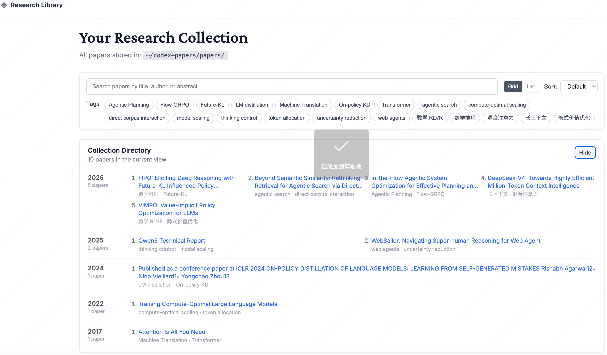
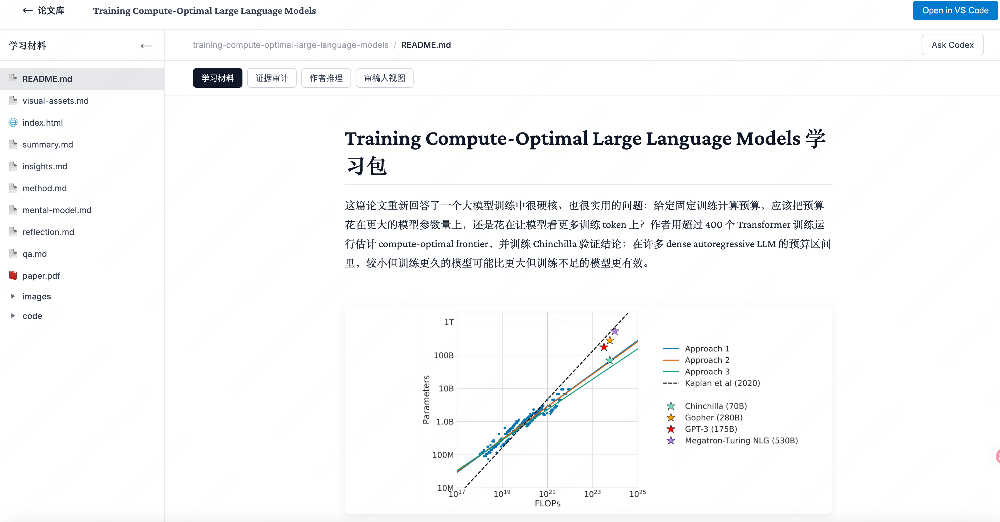

<div align="center">

# Codex Paper

**将研究论文转化为综合学习环境**

[English](README.md) | [中文](README.zh-CN.md)

[](./LICENSE)
[](https://nodejs.org)
[](https://openai.com)

Codex Paper 是一个 Codex 插件，可以把研究论文转化为可复用的论文学习包。它会先构建只来自论文本身的证据记录和结构化研究推理分析，再让 Codex 基于这些证据撰写学习笔记、方法解释、代码演示、图表导读、交互式页面和后续问答上下文，而不是把原始解析结果直接模板化成学习材料。

<table>
  <tr>
    <td align="center">
      
      <br/>
      <sub>论文库 - 搜索、筛选并打开已保存的论文学习包</sub>
    </td>
    <td align="center">
      
      <br/>
      <sub>论文学习页 - 阅读证据驱动的笔记、研究推理、证据审计和追问上下文</sub>
    </td>
  </tr>
</table>

</div>

## 功能特性

- **自动 PDF 解析** - 使用分层解析器提取标题、作者、摘要、章节和代码链接
- **长论文处理** - 解析大型论文时记录质量标记，并在抽取不完整时保守降级
- **代码仓库检测** - 自动发现 GitHub、arXiv、CodeOcean 链接
- **Evidence-first 论文准备** - 先生成内部证据文件 `paper-data.json`、`facts.json`、`analysis.json`
- **证据账本** - 写出 `evidence-ledger.json`，包含稳定 evidence ID、逐页文本、章节树、证据单元、自然位置和解析质量降级标记
- **研究推理分析** - 新增 `reasoning-analysis.json`，记录中心主张、研究问题、作者推理路径、验证、最弱假设、最小复现、最强反例、后续研究和不确定区域
- **语义验证** - 检查 schema、证据引用、source type、数字 grounding、推理图环路、批判性分析覆盖和模板残留
- **Context modes** - 默认离线 `paper-only`；`canonical` 和 `literature` 将外部证据单独写入 `.codex-paper/external-evidence.json`，不混入论文证据账本
- **解析 benchmark 套件** - 基于固定的 5 篇论文 gold 集做回归检查
- **Reasoning/package benchmark** - 新增确定性 fixtures，回归检查研究推理质量和可见学习包质量
- **Codex 写作学习包** - 基于论文正文和证据生成 `README.md`、`summary.md`、`insights.md`、`method.md`、`mental-model.md`、`reflection.md`、`qa.md`
- **克制的图表学习路径** - 生成 `visual-assets.md`，只在合适位置插入有来源、有解释、能帮助理解的高价值图表和确定性图解
- **代码演示** - 至少生成一个可独立运行、与论文核心概念相关的代码示例
- **交互式网页查看器** - Nuxt.js 界面，默认展示用户可见材料，隐藏内部 JSON，并支持 `index.html` iframe 交互展示
- **Ask Codex 追问** - 可以在单篇论文页向 Codex 提问，并把回答保存到 `chat-notes.md`
- **智能评估** - 难度级别和论文类型检测，实现自适应内容生成

---

## Codex 插件结构

这个仓库已经整理为标准 Codex 插件结构，当前使用的实现位于 `plugins/codex-paper/`：

- Codex 插件根目录：`plugins/codex-paper/`
- Codex manifest：`plugins/codex-paper/.codex-plugin/plugin.json`
- 仓库内 marketplace 条目：`.agents/plugins/marketplace.json`
- 历史源码副本保留在：`plugin/`

正常安装时应选择指向 `plugins/codex-paper/` 的 marketplace 条目。顶层 `plugin/` 目录只是历史参考副本，日常使用不需要选择它。

对外使用时，插件名和 skill 名是分开的：

- 插件名：`codex-paper`
- 深度阅读 skill：`$paper-study`
- 快速摘要 skill：`$paper-summary`
- 网页查看器 skill：`$paper-webui`
- 追问问答 skill：`$paper-chat`

---

## 快速开始

### 安装

将这个仓库注册为 Codex marketplace：

```bash
git clone https://github.com/byxshr/codex-paper.git ~/codex-paper
```

在 `~/.codex/config.toml` 中添加 marketplace 并启用插件：

```toml
[marketplaces.codex-paper]
source_type = "local"
source = "/Users/YOUR_USER/codex-paper"

[plugins."codex-paper@codex-paper"]
enabled = true
```

把 `/Users/YOUR_USER/codex-paper` 替换成你 clone 后的绝对路径，然后重启 Codex。打开 `/plugins`，搜索 `codex-paper`，如果插件浏览器提示安装或启用，按提示操作即可。

如果你已经安装过旧版 Codex Paper，拉取本仓库更新后需要在 `/plugins` 里更新或重装插件。优先选择指向当前 checkout 的本地 marketplace 条目。如果旧的 `codex-paper@codex-paper` 和本地 `codex-paper@codex-paper-local` 同时启用，请禁用过期条目，避免 Codex 加载旧版本。

重启后可以这样使用：

```text
请使用 $paper-study 阅读 ~/Downloads/attention-is-all-you-need.pdf 这篇论文，并用中文生成完整学习包。
```

如果只需要快速摘要：

```text
请使用 $paper-summary 快速总结 https://arxiv.org/abs/1706.03762
```

**就这样！** 插件将自动：
- 安装所有依赖项（Node.js 依赖和用于 PDF 处理的 `PyMuPDF`）
- 在 `~/codex-papers/` 创建论文目录
- 初始化搜索索引
- 安装网页查看器依赖项

### 系统要求

- **Node.js**: 18.0.0 或更高版本
- **npm**: 随 Node.js 一起安装
- **Codex**: 支持插件的最新版本
- **poppler-utils**: 用于 PDF 图像提取（通过系统包管理器安装）
  - **macOS**: `brew install poppler`
  - **Ubuntu/Debian**: `sudo apt-get install poppler-utils`
  - **Arch Linux**: `sudo pacman -S poppler`

---

## 使用方法

### 学习研究论文

直接与 Codex 对话来学习论文：

```
请使用 $paper-study 阅读 ~/Downloads/attention-is-all-you-need.pdf 这篇论文，并用中文生成完整学习包。
```

您也可以使用 URL：

```
# 直接 PDF 链接
请使用 $paper-study 阅读 https://arxiv.org/pdf/1706.03762.pdf 这篇论文

# arXiv 摘要链接（自动转换为 PDF）
请使用 $paper-study 阅读 https://arxiv.org/abs/1706.03762 这篇论文
```

如果只需要快速摘要：

```
请使用 $paper-summary 快速总结 https://arxiv.org/abs/1706.03762
```

如果想追问已经生成的学习包：

```
请使用 $paper-chat 回答 ~/codex-papers/papers/attention-is-all-you-need 这篇论文的问题：
self-attention 和循环式序列建模的关键差异是什么？
```

Codex 将自动触发学习工作流程并：
1. 解析 PDF，准备元数据、正文、facts、analysis 和证据账本
2. 推断论文 profile，脚手架生成 `reasoning-analysis.json`，并阅读对应 profile 契约
3. 从论文证据中填写研究推理，然后在写作可见材料前运行严格语义验证
4. 基于证据写作完整学习材料，而不是直接渲染机器 JSON
5. 生成自包含的 `index.html` 交互式探索器
6. 创建至少一个可独立运行的代码演示
7. 复制原始 `paper.pdf`，筛选关键视觉资产，避免把低价值碎图堆进阅读流
8. 创建隐藏的问答证据导航包，方便后续 grounded 追问
9. 更新全局搜索索引
10. 刷新论文库索引，方便网页查看器展示；需要查看时可用 `$paper-webui` 启动

### 启动网页查看器

```text
请使用 $paper-webui 启动 Codex Paper 网页查看器。
```

在 **http://localhost:5815** 打开交互式网页界面，您可以：
- 浏览所有已学习的论文
- 查看生成的 Markdown、HTML、PDF、图片和代码材料
- 在 iframe 中交互式查看每篇论文的 `index.html`
- 访问代码演示
- 在单篇论文页向 Codex 追问，并把回答保存到 `chat-notes.md`
- 搜索论文库

Ask Codex 会在网页首次提问时懒启动一个长期运行的 `codex mcp-server` worker。网页查看器会为每篇论文保留独立的 Codex thread，因此同一论文的后续追问可以复用对话上下文，不再每次启动新的 `codex exec` 进程。回答仍然运行在只读 sandbox 中，并优先使用 `.codex-paper/answering-pack.md`；旧学习包没有该文件时，会回退到用户可见 Markdown 材料和本地证据文件。

---

## 论文存储结构

论文按 `~/codex-papers/papers/{paper-slug}/` 组织：

```
~/codex-papers/
├── papers/
│   └── {paper-slug}/
│       ├── README.md                     # 快速导航和概览
│       ├── visual-assets.md              # 图表导航、来源和推荐阅读位置
│       ├── summary.md                    # 详细摘要
│       ├── insights.md                   # 核心洞察力（最重要！）
│       ├── method.md                     # 方法结构、流程、伪代码和复现风险
│       ├── mental-model.md              # 先验知识、研究地图和论文归类
│       ├── reflection.md                # 可扩展方向、脆弱假设和未来问题
│       ├── qa.md                         # 分层学习问答
│       ├── chat-notes.md                 # Web UI 追问产生的问答笔记
│       ├── index.html                    # 交互式 HTML 探索器
│       ├── paper.pdf                     # 原始 PDF 文件副本
│       ├── evidence-ledger.json          # 内部 paper-only 证据账本
│       ├── reasoning-analysis.json       # 内部研究推理分析契约
│       ├── images/                       # 筛选后的论文图表、表格和必要页面预览
│       │   ├── fig1.png
│       │   └── fig2.png
│       ├── code/                         # 代码演示
│       │   └── core-concept-demo.py      # 至少一个可独立运行的核心概念示例
│
│       # 以下 JSON 是内部证据文件，Web UI 默认隐藏
│       ├── paper-data.json               # 标准化解析事实源
│       ├── facts.json                    # 带证据的 claims / results / limitations
│       ├── analysis.json                 # 结构化分析草稿
│       ├── meta.json                     # 论文元数据（标题、作者等）
│
│       # 用于高质量追问回答的隐藏本地上下文
│       └── .codex-paper/
│           ├── answering-pack.md         # $paper-chat 使用的证据导航包
│           ├── external-evidence.json    # canonical/literature 模式下的可选外部证据
│           ├── reasoning-review.md       # 固定自审清单
│           └── validation-report.json    # 最新验证报告
│
└── index.json                           # 全局搜索索引
```

### 验证和迁移

运行完整确定性套件：

```bash
bash scripts/codex-paper.sh install
bash scripts/codex-paper.sh test
bash scripts/codex-paper.sh benchmark-all
bash scripts/codex-paper.sh smoke-test
bash scripts/codex-paper.sh build
```

验证一个已完成的学习包：

```bash
node plugins/codex-paper/skills/study/scripts/validate-reasoning.js ~/codex-papers/papers/{paper-slug} --strict
node plugins/codex-paper/skills/study/scripts/validate-study-package.js ~/codex-papers/papers/{paper-slug} --run-code
```

将旧学习包迁移为草稿证据/推理文件，不编造高层研究分析：

```bash
bash scripts/codex-paper.sh migrate ~/codex-papers/papers/{paper-slug}
```

库外 package 目录需要显式迁移：

```bash
bash scripts/codex-paper.sh migrate /path/to/package --external-path
```

填写草稿推理分析前，可以先做一次迁移结果 sanity check：

```bash
node plugins/codex-paper/skills/study/scripts/validate-reasoning.js ~/codex-papers/papers/{paper-slug} --allow-draft
```

详细包契约见[证据账本](docs/evidence-ledger.md)、[研究推理分析](docs/reasoning-analysis.md)、[学习包契约](docs/package-v2.md)和[迁移指南](docs/migration-v1-to-v2.md)文档。

---

## 架构

### 插件结构

```
codex-paper/
├── .codex-plugin/
│   └── marketplace.json              # 市场目录条目
├── plugin/                           # 保留的旧副本，仅供参考
├── plugins/
│   └── codex-paper/
│       ├── .codex-plugin/
│       │   └── plugin.json              # 插件清单
│       ├── skills/
│       │   ├── study/
│       │   │   ├── SKILL.md             # 学习工作流定义
│       │   │   └── scripts/
│       │   │       ├── parse-pdf.js     # 稳定 JSON 解析器
│       │   │       ├── prepare-paper.js # 标准化论文准备入口
│       │   │       └── extract-images.py
│       │   ├── summary/
│       │   │   └── SKILL.md             # 带证据约束的快速摘要
│       │   ├── chat/
│       │   │   └── SKILL.md             # 基于证据的追问问答
│       │   └── webui/
│       │       └── SKILL.md             # 本地网页查看器启动
│       ├── hooks/
│       │   ├── hooks.json               # 会话生命周期钩子
│       │   └── check-install.sh
│       ├── src/
│       │   └── web/                     # Nuxt.js 网页查看器
│       └── package.json
├── benchmarks/
│   ├── manifest.json                    # 固定 parser benchmark 集
│   ├── gold/                            # 5 篇论文的人工期望
│   ├── reasoning/                       # reasoning validator fixtures
│   ├── packages/                        # 可见学习包质量 fixtures
│   ├── run-benchmark.mjs                # benchmark 执行器
│   ├── run-reasoning-benchmark.mjs      # reasoning benchmark 入口
│   ├── run-package-benchmark.mjs        # package benchmark 入口
│   └── benchmark-report.mjs             # 可读报告格式化脚本
└── README.md
```

### 核心组件

1. **学习技能** - Codex 论文阅读和写作 agent，负责生成完整学习包
2. **PDF 解析器** - 使用 `PyMuPDF` 优先、`pdf-parse` 回退的分层解析器，并稳定输出 JSON
3. **图像提取器** - PDF 图表提取的 Python 脚本
4. **准备链路** - 生成内部证据文件 `paper-data.json`、`facts.json`、`analysis.json`、`meta.json` 和 `evidence-ledger.json`，并更新 `~/codex-papers/index.json`
5. **研究推理验证** - 使用 `reasoning-analysis.json`、论文 profile 和 `validate-reasoning.js` 约束证据引用、source type、数字 grounding、推理 DAG 和批判性分析
6. **网页查看器** - 带 Nitro API 的 Nuxt.js 应用，默认展示用户材料，隐藏机器 JSON，并展示证据审计和作者推理视图
7. **Ask Codex API** - 复用长期运行的 Codex MCP worker 处理基于证据的追问，并将回答追加到 `chat-notes.md`
8. **钩子系统** - 自动依赖安装和设置

---

## 开发

### 单一入口脚本

本地安装和测试统一通过一个根目录脚本完成：

```bash
bash scripts/codex-paper.sh install
bash scripts/codex-paper.sh build
bash scripts/codex-paper.sh start
bash scripts/codex-paper.sh stop
bash scripts/codex-paper.sh status
bash scripts/codex-paper.sh smoke-test
bash scripts/codex-paper.sh benchmark
bash scripts/codex-paper.sh benchmark-all
bash scripts/codex-paper.sh benchmark-report
```

这样用户只需要记一个入口，`scripts/common.sh` 继续只做内部复用。

### 运行测试

```bash
# 测试 PDF 解析
node plugins/codex-paper/skills/study/scripts/parse-pdf.js /path/to/paper.pdf

# 先准备论文数据、facts.json 和 evidence-ledger.json
node plugins/codex-paper/skills/study/scripts/prepare-paper.js /path/to/paper.pdf

# 校验研究推理
node plugins/codex-paper/skills/study/scripts/validate-reasoning.js paper-slug --strict

# 校验已生成的学习包
node plugins/codex-paper/skills/study/scripts/validate-study-package.js paper-slug --lang zh --run-code

# 跑 parser、reasoning 和 package benchmark
bash scripts/codex-paper.sh benchmark-all

# 测试网页查看器
bash scripts/codex-paper.sh start
```

### 生产构建

```bash
# 构建网页查看器
bash scripts/codex-paper.sh build

# 构建的查看器将在 plugins/codex-paper/src/web/.output/ 目录中
```

---

## 配置

### 环境变量

无需配置！插件使用合理的默认值：

- **论文目录**: `~/codex-papers/`
- **Benchmark 目录**: `~/codex-papers/paper-examples`
- **网页查看器端口**: `5815`
- **长论文行为**: 抽取质量标记和保守降级信息会记录在生成的学习包中

### 高级自定义

您可以通过编辑这些文件来修改行为：

- `plugins/codex-paper/skills/study/SKILL.md`
- `plugins/codex-paper/skills/summary/SKILL.md`
- `benchmarks/gold/*.json`

---

## 贡献

欢迎贡献！请：

1. Fork 仓库
2. 创建功能分支 (`git checkout -b feature/amazing-feature`)
3. 进行更改
4. 如适用，添加测试
5. 提交更改 (`git commit -m 'add amazing feature'`)
6. 推送到分支 (`git push origin feature/amazing-feature`)
7. 打开 Pull Request

---

## 许可证

本项目采用 **MIT 许可证** - 详见 [LICENSE](LICENSE) 文件。

---

## 致谢

- 面向 Codex 构建
- PDF 解析由 [PyMuPDF](https://pymupdf.readthedocs.io/) 提供主路径，并以 [pdf-parse](https://www.npmjs.com/package/pdf-parse) 作为回退
- 网页查看器由 [Nuxt.js](https://nuxt.com) 构建
- 数学渲染由 [KaTeX](https://katex.org) 提供支持
- 感谢 [alaliqing/claude-paper](https://github.com/alaliqing/claude-paper/) 和 [FeijiangHan/PaperForge](https://github.com/FeijiangHan/PaperForge) 带来的设计启发
